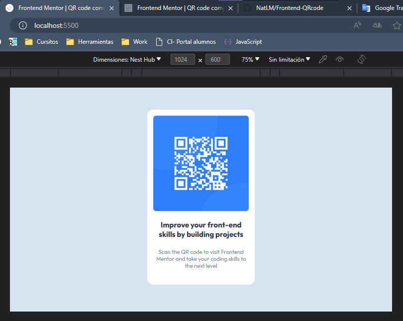

# Frontend Mentor - QR code component solution

This is a solution to the [QR code component challenge on Frontend Mentor](https://www.frontendmentor.io/challenges/qr-code-component-iux_sIO_H). Frontend Mentor challenges help you improve your coding skills by building realistic projects. 

## Overview

### Screenshot

### Links

- [Solution URL](https://github.com/NataliaLM-26/frontendMentor_QRCode)
- [Live Site URL](https://front-codigoqr.netlify.app/)

## My process

### Built with

- Semantic HTML5 markup
- CSS custom properties
- Flexbox
- CSS Grid

## Author

- Website - [Natalia López Miranda](https://github.com/NataliaLM-26)
- Frontend Mentor - [@NatLM](https://www.frontendmentor.io/profile/NataliaLM-26)
- Twitter - [@NatLM_02](https://x.com/NataliaLM_26)
